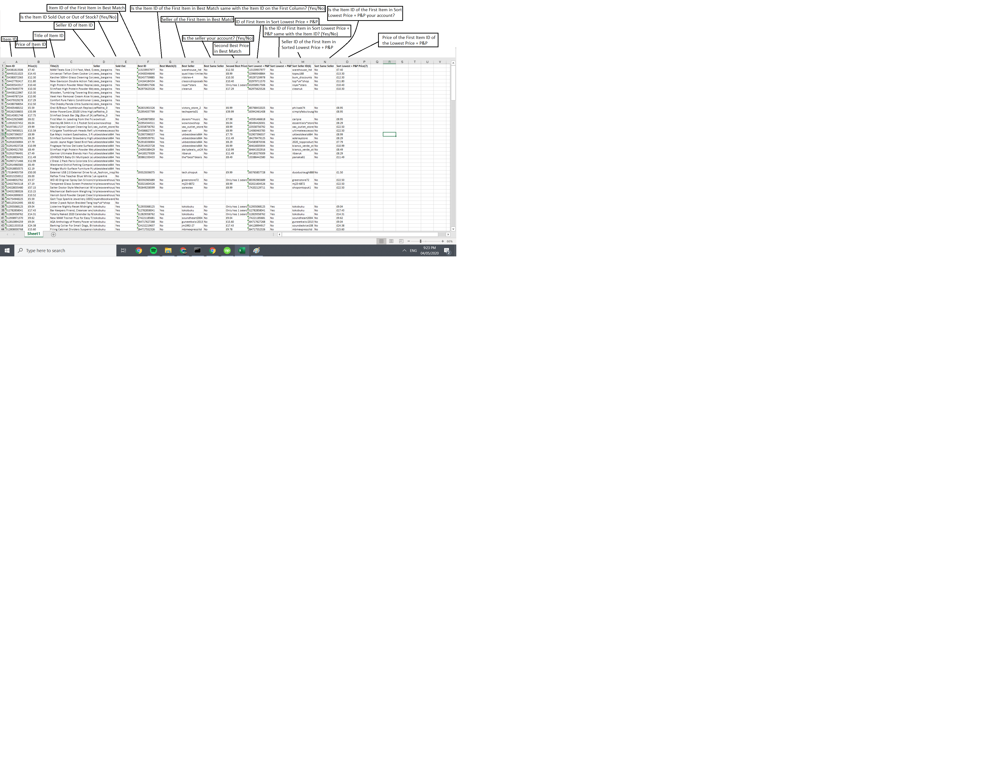
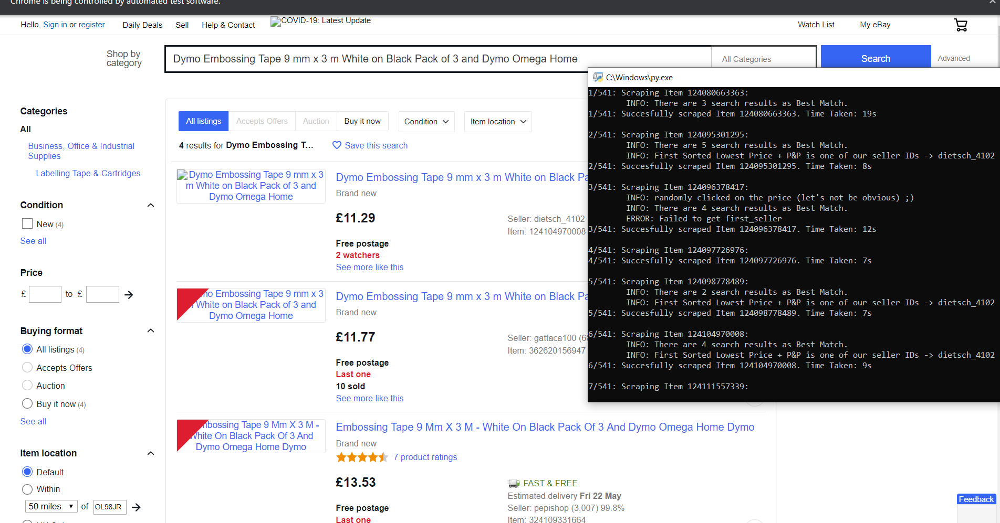

# Ebay-Product-Scraper 
This web scraper program is useful for those who are using Ebay and would want to check whether the item they're selling is the cheapest or not. From that knowledge, you'll be able to adjust your prices if yours is too high or you can also use it to scout prices. You can get the documentation in this link https://docs.google.com/document/d/1emT28jOHaI44B8gtHYnciKcVmExIeg6465uTYvO1HNc/edit?usp=sharing

# Method
1. Extract the **Item IDs**(to know which items to check) and **Seller IDs**(to distinguish which accounts are yours) from .xlsx Files
2. Go to Item Page (ebay.co.uk/itm/#item_no)
3. Extract the item **Name, Price, and Seller** 
4. Then remove all non-alphabetical characters in the name then use that to **search the Best Match**
5. Extract the first **Item's ID (to know if it is the same item with the one you used), and Price(to know if it's actually higher or lower)**
6. Then Sort it by **Lowest Price + P&P**
7. Then extract the price, item id, and seller of **product with the lowest price**

# Screenshots:
  

